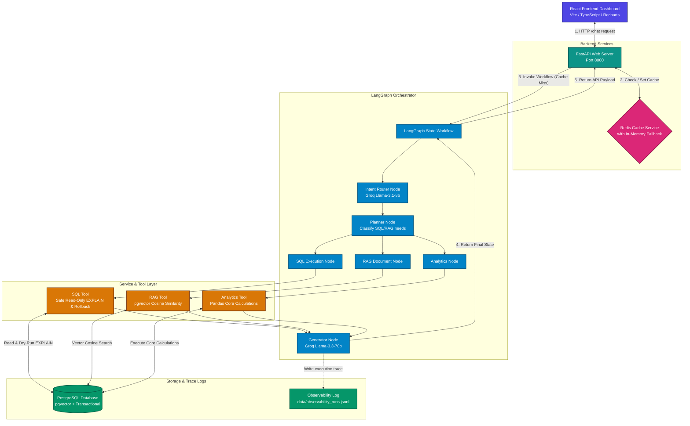

# AI Data Analyst Agent

An enterprise-grade, production-style AI Data Analyst Agent platform built using FastAPI, PostgreSQL (with `pgvector`), SQLAlchemy ORM, LangGraph, and Groq LLMs. The platform is capable of answering complex business questions by dynamically routing queries to structured database access, unstructured document search, or analytical computation engines. It features a complete Redis caching layer (with automatic in-memory fallback) and an interactive React/TypeScript dashboard with responsive charting.

---

## Architecture Diagram

This diagram visualizes the overall architecture of the platform, tracking the query flow from the React frontend dashboard down to the database, caching layer, and LangGraph workflow orchestration:



---

## Core Capabilities

### 1. Intent Router
- Employs **Groq JSON-mode** to classify incoming requests into 5 distinct intents:
  - `SQL_QUERY`: Queries answered by structured database operations.
  - `RAG_QUERY`: Queries answered by company manuals, contracts, or SOP documents.
  - `HYBRID_QUERY`: Queries combining structured database data and document references.
  - `ANALYTICS_QUERY`: Queries needing statistical and complex calculations (growth rates, turnover).
  - `UNSUPPORTED_QUERY`: Off-topic queries.
- Returns structured JSON mappings defining exactly which pipelines (`needs_sql`, `needs_rag`) to invoke.

### 2. Guardrailed SQL Execution Engine
- Generates standard PostgreSQL queries using LLM schema matching.
- **SQL Guardrail Rejection**: Blocks queries containing mutation keywords (`DROP`, `DELETE`, `UPDATE`, `ALTER`, `TRUNCATE`, `INSERT`, `CREATE`, etc.) to enforce a strict read-only access layer.
- **Syntax Validation & Self-Correction**: Performs a dry-run `EXPLAIN` on generated SQL statements prior to physical execution, auto-correcting syntax on failures.
- **PostgreSQL Transaction Safety**: Automatically performs session rollbacks (`self.db.rollback()`) on validation failures, preventing aborted transactions (`InFailedSqlTransaction` errors) from stalling the agent.

### 3. pgvector RAG Pipeline
- Implements semantic document search using native PostgreSQL `pgvector` columns.
- Generates 384-dimensional document chunk embeddings using local **Sentence Transformers `all-MiniLM-L6-v2`** running completely offline.
- Attributes source files (`Source: filename.pdf`) with similarity confidence scores.

### 4. Mathematical & Analytics Service
- Enforces a zero-LLM-math policy. All calculations are handled strictly by a Python/Pandas calculation engine to ensure 100% mathematical accuracy.
- Computes **Month-over-Month (MoM) revenue growth rates**, **Inventory Turnover ratios** ($\text{COGS} / \text{Average Inventory Value}$), and cross-month sales distribution comparisons.

### 5. Redis Caching Layer
- Normalizes incoming queries into cache keys: `cache:query:<lowercase_trimmed_query>`.
- Serves repeated queries instantly, bypassing Intent Routing and LLM generation to reduce API costs and latency.
- **Graceful Fallback**: If the Redis server is unreachable, the system automatically falls back to a thread-safe, in-memory dictionary cache.

### 6. Observability and Performance Logger
- Appends complete trace reports of every run to `data/observability_runs.jsonl` containing:
  - Original Query
  - Intent classification & Explanation
  - Selected Tools
  - Generated SQL (if any)
  - Execution Status
  - Latency breakdown

### 7. Interactive React/Vite Frontend
- Built with React, TypeScript, and Recharts.
- Includes auto-charting logic that evaluates the returned SQL dataset:
  - Plots chronological data trends as **Area/Line Charts**.
  - Plots categorical comparisons as **Bar Charts**.
- Features expandable SQL accordions, clickable prompt suggestion cards, and RAG document reference badges.

---

## Directory Structure

```text
├── app/
│   ├── agents/
│   │   ├── router.py             # Groq-powered Intent Router
│   │   └── workflow.py           # LangGraph state graph routing pipeline
│   ├── api/
│   │   └── endpoints.py          # FastAPI endpoint handlers
│   ├── database/
│   │   └── __init__.py           # SQLAlchemy Connection, Session, Engine
│   ├── evaluation/
│   │   ├── dataset.json          # 6 benchmark test cases
│   │   └── evaluator.py          # Benchmark metrics calculator
│   ├── models/
│   │   └── __init__.py           # SQLAlchemy DB Models (including pgvector)
│   ├── repositories/
│   │   ├── __init__.py           # Repository classes (concrete entity operations)
│   │   └── base.py               # Abstract Generic Base Repository CRUD
│   ├── schemas/
│   │   └── __init__.py           # FastAPI/Pydantic validation schemas
│   ├── services/
│   │   ├── analytics_service.py  # Core Pandas/NumPy calculation formulas
│   │   ├── cache_service.py      # Redis Cache Service with memory fallback
│   │   └── embedding.py          # SentenceTransformers offline singleton wrapper
│   ├── tools/
│   │   ├── analytics_tool.py     # Analytics execution wrapper tool
│   │   ├── rag_tool.py           # pgvector retrieval search tool
│   │   └── sql_tool.py           # Safe SQL validation and execution tool
│   ├── utils/
│   │   └── logger.py             # Observability file logger service
│   ├── config.py                 # Dynamic dotenv configuration reader
│   └── main.py                   # FastAPI app instantiation and middlewares
├── data/
│   ├── documents/                # Generated business PDFs (contracts, SOPs, reports)
│   ├── evaluation_report.json    # Generated evaluator benchmarks
│   └── observability_runs.jsonl  # Observability runs trace log
├── frontend/                     # Interactive React Dashboard
│   ├── src/
│   │   ├── App.css               # Main dashboard layout styles
│   │   ├── App.tsx               # Primary dashboard interface & charts
│   │   ├── index.css             # Theme variables and utilities
│   │   └── main.tsx              # Vite/React entry point
│   ├── package.json              # Frontend dependencies (Vite, Recharts, Lucide)
│   └── vite.config.ts            # Vite bundler configuration
├── tests/
│   └── test_agent.py             # Unit testing suite
├── .env                          # Configuration secrets (gitignored)
├── Dockerfile                    # Container configuration
└── docker-compose.yml            # Multi-service deployment config
```

---

## Installation & Setup

### 1. Clone and Navigate to Workspace
```bash
cd "Ai Analyst"
```

### 2. Set Up Virtual Environment & Dependencies
```bash
python -m venv venv
.\venv\Scripts\activate
pip install -r requirements.txt
```

### 3. Configure Environment Variables
Create a `.env` file in the root directory:
```ini
DATABASE_URL=postgresql://<user>:<password>@<host>:5432/<dbname>
REDIS_URL=redis://localhost:6379/0
GROQ_API_KEY=your_groq_api_key
EMBEDDING_MODEL_NAME=all-MiniLM-L6-v2
GROQ_ROUTER_MODEL=llama-3.1-8b-instant
GROQ_SQL_MODEL=llama-3.1-8b-instant
GROQ_GENERATOR_MODEL=llama-3.3-70b-versatile
HF_HUB_OFFLINE=1
TRANSFORMERS_OFFLINE=1
```

### 4. Initialize Database & Embed Documents
Ensure PostgreSQL is running, then populate the tables and semantic document vector embeddings:
```bash
python scripts/ingest_all.py
```

### 5. Start the Backend API Server
```bash
python -m uvicorn app.main:app --reload
```
- Interactive Swagger OpenAPI Docs: `http://127.0.0.1:8000/docs`

### 6. Setup and Launch the Frontend Dashboard
Open a new terminal window:
```bash
cd frontend
npm install
npm run dev
```
- Access the Dashboard at: `http://localhost:5173/`

---

## Verification & Testing

### 1. Run Unit Tests
To verify intent routing, SQL safety guardrails, caching layer, and RAG search:
```bash
python -m unittest tests/test_agent.py
```

### 2. Run Evaluation Benchmarks
To run the evaluation harness against the ground-truth dataset:
```bash
python app/evaluation/evaluator.py
```
Outputs are compiled into `data/evaluation_report.json`.
