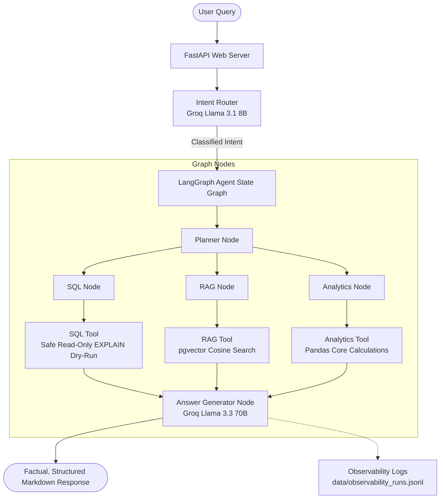

# AI Data Analyst Agent

An enterprise-grade, production-style AI Data Analyst Agent platform built using FastAPI, PostgreSQL (with `pgvector`), SQLAlchemy ORM, LangGraph, and Groq LLMs. The platform is capable of answering complex business questions by dynamically routing queries to structured database access, unstructured document search, or analytical computation engines.

---

## Architecture Diagram



---

## Core Capabilities

### 1. Intent Router
- Employs **Groq JSON-mode** to classify incoming requests into 5 distinct intents:
  - `SQL_QUERY`: Queries answered by structured database operations.
  - `RAG_QUERY`: Queries answered by company manuals, contracts, or SOP documents.
  - `HYBRID_QUERY`: Queries combining structured database data and document references.
  - `ANALYTICS_QUERY`: Queries needing statistical and complex calculations (growth rates, turnover).
  - `UNSUPPORTED_QUERY`: Off-topic queries.
- Returns structured JSON mappings defining exactly which pipelines (`needs_sql`, `needs_rag`) to fire.

### 2. Guardrailed SQL Execution Engine
- Generates standard PostgreSQL queries using LLM schema matching.
- **SQL Guardrail Rejection**: Blocks queries containing mutation keywords (`DROP`, `DELETE`, `UPDATE`, `ALTER`, `TRUNCATE`, `INSERT`, `CREATE`, etc.) to enforce a strict read-only access layer.
- **Syntax Validation**: Performs a dry-run `EXPLAIN` on generated SQL statements prior to physical execution, auto-correcting syntax on failures.
- **Context Truncation**: Truncates prompt SQL contexts to the first 50 rows to prevent context-window blowing or rate limits.

### 3. pgvector RAG Pipeline
- Implements semantic document search using native PostgreSQL `pgvector` columns.
- Generates 384-dimensional document chunk embeddings using local **Sentence Transformers `all-MiniLM-L6-v2`** running completely offline.
- Attributes source files (`Source: filename.pdf`) with similarity confidence scores.

### 4. Mathematical & Analytics Service
- Enforces a zero-LLM-math policy. All calculations are handled strictly by a Python/Pandas calculation engine to ensure 100% mathematical accuracy.
- Computes **Month-over-Month (MoM) revenue growth rates**, **Inventory Turnover ratios** ($\text{COGS} / \text{Average Inventory Value}$), and cross-month sales distribution comparisons.

### 5. Observability and Performance Logger
- Appends complete trace reports of every run to `data/observability_runs.jsonl` containing:
  - Original Query
  - Intent classification & Explanation
  - Selected Tools
  - Generated SQL (if any)
  - Execution Status
  - Latency breakdown

### 6. Automated Evaluation Framework
- A benchmark testing harness executing queries against ground-truth facts.
- Evaluates and outputs:
  - Intent Classification Accuracy
  - SQL Syntax Validity & Accuracy
  - RAG Retrieval Accuracy
  - Final Answer Fact Accuracy
  - Latency Profiles

---

## Directory Structure

```text
├── app/
│   ├── agents/
│   │   ├── router.py             # Groq-powered Intent Router
│   │   └── workflow.py           # LangGraph state graph routing pipeline
│   ├── api/
│   │   └── endpoints.py          # FastAPI endpoint handlers
│   ├── database/
│   │   └── __init__.py           # SQLAlchemy Connection, Session, Engine
│   ├── evaluation/
│   │   ├── dataset.json          # 6 benchmark test cases
│   │   └── evaluator.py          # Benchmark metrics calculator
│   ├── models/
│   │   └── __init__.py           # SQLAlchemy DB Models (including pgvector)
│   ├── repositories/
│   │   ├── __init__.py           # Repository classes (concrete entity operations)
│   │   └── base.py               # Abstract Generic Base Repository CRUD
│   ├── schemas/
│   │   └── __init__.py           # FastAPI/Pydantic validation schemas
│   ├── services/
│   │   ├── analytics_service.py  # Core Pandas/NumPy calculation formulas
│   │   └── embedding.py          # SentenceTransformers offline singleton wrapper
│   ├── tools/
│   │   ├── analytics_tool.py     # Analytics execution wrapper tool
│   │   ├── rag_tool.py           # pgvector retrieval search tool
│   │   └── sql_tool.py           # Safe SQL validation and execution tool
│   ├── utils/
│   │   └── logger.py             # Observability file logger service
│   ├── config.py                 # Dynamic dotenv configuration reader
│   └── main.py                   # FastAPI app instantiation and middlewares
├── data/
│   ├── evaluation_report.json    # Generated evaluator benchmarks
│   └── observability_runs.jsonl  # Observability runs trace log
├── tests/
│   └── test_agent.py             # Unit testing suite
├── .env                          # Configuration secrets (gitignored)
├── Dockerfile                    # Container configuration
└── docker-compose.yml            # Multi-service deployment config
```

---

## Installation & Setup

1. **Clone the repository and navigate into the workspace**:
   ```bash
   cd "Ai Analyst"
   ```

2. **Set up the Python Virtual Environment**:
   ```bash
   python -m venv venv
   .\venv\Scripts\activate
   pip install -r requirements.txt
   ```

3. **Configure Environment Variables**:
   Create a `.env` file in the root directory:
   ```ini
   DATABASE_URL=postgresql://<user>:<password>@<host>:5432/<dbname>
   GROQ_API_KEY=your_groq_api_key
   EMBEDDING_MODEL_NAME=all-MiniLM-L6-v2
   GROQ_ROUTER_MODEL=llama-3.1-8b-instant
   GROQ_SQL_MODEL=llama-3.1-8b-instant
   GROQ_GENERATOR_MODEL=llama-3.3-70b-versatile
   HF_HUB_OFFLINE=1
   TRANSFORMERS_OFFLINE=1
   ```

4. **Verify / Load the Database**:
   Ensure PostgreSQL is running, then populate database tables and semantic document embeddings:
   ```bash
   python scripts/ingest_all.py
   ```

---

## Verifying Correctness

### 1. Run Unit Tests
To verify individual agent component logic (Intent classification, SQL safety blocking, and RAG retrieval):
```bash
python -m unittest tests/test_agent.py
```

### 2. Run Evaluation Benchmarks
To run the automated agent evaluation engine and generate accuracy metrics:
```bash
python app/evaluation/evaluator.py
```
This produces a summary report and stores details in `data/evaluation_report.json`.

---

## Running the Web API

1. **Launch the FastAPI application**:
   ```bash
   python -m uvicorn app.main:app --reload
   ```
2. **Access Endpoints**:
   - Interactive OpenAPI UI: `http://127.0.0.1:8000/docs`
   - `/chat` [POST]: Send inquiries to the LangGraph Data Analyst Agent.
   - `/analytics/report` [GET]: Fetch calculated Pandas KPI summaries.
   - `/documents` [GET]: List uploaded business files.
